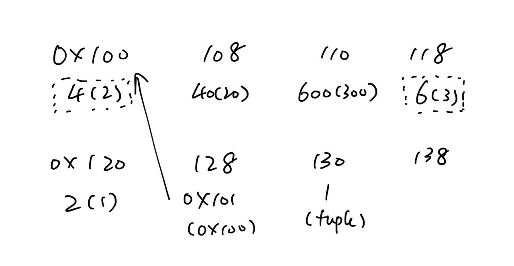

# Yizhao's Egg-Eater Compiler

## Grammer
### Syntax
The syntax of my egg-eater language is shown as follows.

```
<prog> := <defn>* <expr>               
<defn> := (fun (<name> <name>*) <expr>)
<expr> :=
  | <number>
  | true
  | false
  | input
  | <identifier>
  | (let (<binding>+) <expr>)
  | (<op1> <expr>)
  | (<op2> <expr> <expr>)
  | (set! <name> <expr>)
  | (if <expr> <expr> <expr>)
  | (block <expr>+)
  | (loop <expr>)
  | (break <expr>)
  | (<name> <expr>*)
  | (tuple <expr>*)                             (NEW!)
  | (index <expr> <expr>)                       (NEW!)

<op1> := add1 | sub1 | isnum | isbool | print
<op2> := + | - | * | < | > | >= | <= | =

<binding> := (<identifier> <expr>)
```

Note that there are two new syntax, `tuple` and `index`. `tuple` has zero or more children while `index` have exactly two.

### Semantics
- `tuple` creates a heap object with zero or more fields, each field being a object (number, boolean or tuple). The internal value of a `tuple` object is a pointer to somewhere on the heap, and the data is stored on the heap.
    - As a special case, `(tuple)` is a valid object. However, instead of an actual pointer, it contains the value `0x1` to represent an empty tuple.
- `index` accesses a certain field in a tuple. More specifically, `(index t i)` accesses the `i`-th field in `t` (0-indexed). If `t` does not contain `i` values (including `t` being empty), or `t` is not a tuple, an runtime error will be issued.
- Other semantical things just follow diamondback. However, there's an intentional change: `=` no longer checks types. Now, it returns `true` if the two (internal) values are equal, and `false` otherwise.

## Heap Arrangement
The following diagram shows what does the heap looks like after evaluating `(tuple 1 (tuple 20 300) (tuple))`.



For each `tuple` object, it first stores its length (using snek representation), which is shown in the diagram by boxed values. It is followed by the fields of that tuple. For nested tuples, the sub-tuples are at lower addresses. `(tuple)` (empty tuple) does not point to somewhere on the stack; it is represented by the value `1`. The metadata (length) and each field takes 8 bytes.

## Tests
### `simple_examples.snek`
#### Code
```
(let (
    (a (tuple))
    (b (tuple 1 20))
    (c (tuple input))
    (d (tuple (tuple -4 -50) b c 300))
)
(block
    (print a)
    (print b)
    (print c)
    (print d)
    (print (index b 0))
    (print (index b 1))
    (print (index c 0))
    (print (index d 0))
    (print (index (index d 1) 0))
    (if (index c 0)
        (print (+ (index b 1) (index d 3)))
        (print (- (index b 1) (index d 3)))
    )
))
```

#### Expected output
```
()
(1 20)
(false)
((-4 -50) (1 20) (false) 300)
1
20
false
(-4 -50)
1
-280
-280
```

#### Explanation
This shows how the tuples are constructed and access through indices. We can see in this example that we can access nested tuples with nested `index`.

### `error-tag.snek`
#### Code
```
(let ((x 100)) (index x 0))
```

#### Expected output
```
an error ocurred invalid argument
```

#### Explanation
An runtime error is thrown, because it try to access a non-tuple object through index.

### `error-bounds.snek`
#### Code
```
(let ((i 0) (x (tuple 1 20 300 4000))) (loop (block
    (print (index x i))
    (set! i (add1 i))
)))
```

#### Expected output
```
1
20
300
4000
an error ocurred index out of range
```

#### Explanation
In this example, each time we increase `i` by `1`. The first few accesses are successful. Once `i` reaches `4` (the length of the tuple), it reports a index-out-of-range error, showing that it's a runtime error.

### `error3.snek`
#### Code
```
(let ((i 0) (x (tuple 1 20 300 4000))) (index x true))
```

#### Expected output
```
an error ocurred invalid argument
```

#### Explanation
For `index`, there are type checks, which requires the first argument being a tuple and the second being a number. This shows throwing a runtime error if the second argument is not a number.

### `points.snek`
#### Code
```
(fun (pair x y) (tuple x y))
(fun (sum x y) (tuple (+ (index x 0) (index y 0)) (+ (index x 1) (index y 1))))
(let (
    (x (pair 1 2))
    (y (pair 30 40))
    (z (pair 500 600))
    (a (sum x y))
    (b (sum x z))
)
(block
    (print x)
    (print y)
    (print z)
    (print a)
    (print b)
    (print (pair -1 -2))
    (print (sum a b))
    (print (pair (tuple) (tuple)))
    0
))
```

#### Expected output
```
(1 2)
(30 40)
(500 600)
(31 42)
(501 602)
(-1 -2)
(532 644)
(() ())
0
```

#### Explanation
This program has the correct behavior of creating points and computing the sum of two points. Note that we can have `(pair (tuple) (tuple))`, which is not essentially a point. This is because there's no type checks in `pair`.

### `bst.snek`
#### Code
```
(fun (insert root value)
    (if (= root (tuple))
        (tuple value (tuple) (tuple))
        (let ((x (index root 0)) (left (index root 1)) (right (index root 2)))
            (if (< value x)
                (tuple x (insert left value) right)
                (if (> value x)
                    (tuple x left (insert right value))
                    root
                )
            )
        )
    )
)

(fun (tr root) (block
    (if (= root (tuple))
        0
        (block
            (tr (index root 1))
            (print (index root 0))
            (tr (index root 2))
        )
    )
))

(fun (contains root value)
    (if (= root (tuple))
        false
        (let ((x (index root 0)) (left (index root 1)) (right (index root 2)))
            (if (< value x)
                (contains left value)
                (if (> value x)
                    (contains right value)
                    true
                )
            )
        )
    )
)

(let ((t1 (tuple)) (t2 (tuple))) (block
    (set! t1 (insert t1 3))
    (set! t1 (insert t1 1))
    (set! t1 (insert t1 4))
    (print t1)
    (set! t1 (insert t1 1))
    (set! t1 (insert t1 5))
    (set! t1 (insert t1 9))
    (print t1)
    (tr t1)
    (print (contains t1 3))
    (print (contains t1 1))
    (print (contains t1 7))
    (print (contains t1 2))
    (set! t2 (insert t2 4))
    (set! t2 (insert t2 2))
    (set! t2 (insert t2 3))
    (set! t2 (insert t2 1))
    (set! t2 (insert t2 6))
    (set! t2 (insert t2 5))
    (set! t2 (insert t2 7))
    (print t2)
    (tr t2)
    (print (contains t2 1))
    (print (contains t2 9))
    0
))
```

#### Expected output
```
(3 (1 () ()) (4 () ()))
(3 (1 () ()) (4 () (5 () (9 () ()))))
1
3
4
5
9
true
true
false
false
(4 (2 (1 () ()) (3 () ())) (6 (5 () ()) (7 () ())))
1
2
3
4
5
6
7
true
false
0
```
#### Explanation
This example contains BST operations, showing the capability of doing recursive operations using `tuple`. `tr` prints the in-order traversal of a BST, showing that the elements are in ascending order.

## Similarity between languages

I know Python and Haskell has heap objects.

For Haskell, lots of things are allocated on stack, and most objects are pointers. Tags are used to track the type of the objects. Objects are immutable. For all the reasons above, my current heap implementation is kind of like Haskell. However, egg-eater is dynamically-typed while Haskell is statically-typed.

For Python, I think most of the things are also pointers. However, there's lots of mutable objects, so I believe my implementation is less like Python.

## Bibliography
I did this assignment mostly by myself without referring to many external documents. I did referred https://github.com/ucsd-compilers-s23/lecture1/tree/egg-eater for basic implementation of heap. I also extensively used https://www.felixcloutier.com/x86/index.html for x86 instructions.